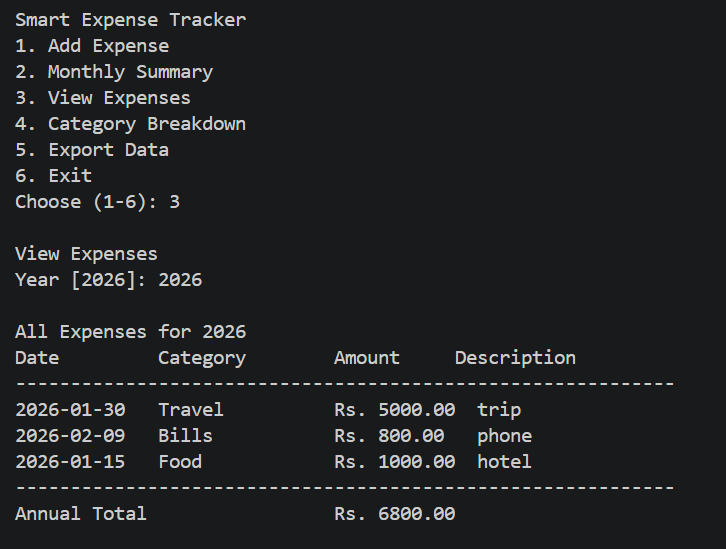
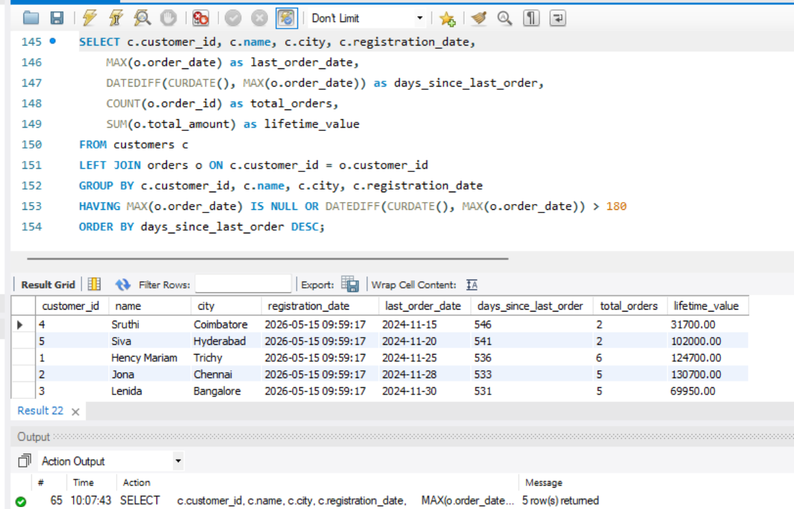
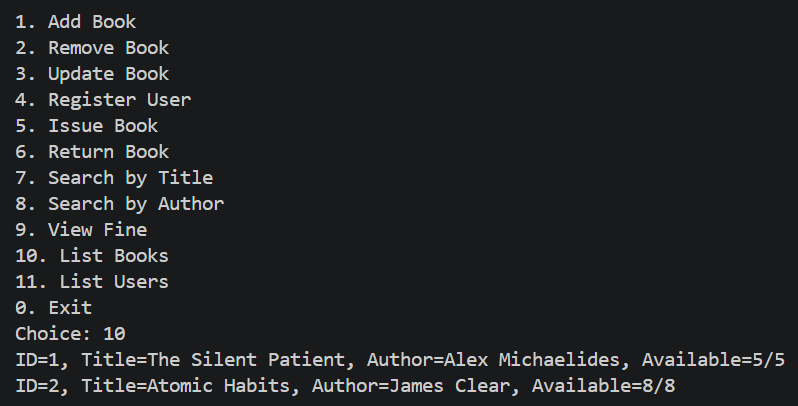

# Virtusa Assignment

Three complete projects in Python, SQL, and Java.

## 1. Expense Tracker (Python)

Command-line app for tracking daily expenses.

**Features:** Add expenses, monthly summaries, annual expense view, category breakdown, pie charts, JSON export

**Run:**
```bash
cd expense-tracker
python expense_tracker.py
```

**Tools:** Python, JSON, matplotlib, datetime


---

## 2. Retail Database (SQL)

Database with 4 tables and 8 analysis queries.

**Tables:** customers, products, orders, order_items  
**Queries:** top products, best customers, revenue trends, category sales, inactive users

**Run:**
```bash
mysql -u root -p
CREATE DATABASE retail_store;
USE retail_store;
SOURCE retail_database.sql;
```

**Tools:** MySQL, Window Functions, Joins, Aggregations



---

## 3. Library Management (Java)

App for managing books, users, and fines.

**Features:** Book management, user registration, issue/return tracking, fine calculation (Rs 5/day), search

**Run:**
```bash
cd library-management
javac LibraryManagement.java
java LibraryGUI
```

**Tools:** Java Swing, OOP, Collections, MVC Pattern



---

## Projects Summary

| | Tracker | Database | Library |
|---|---|---|---|
| Language | Python | SQL | Java |
| Interface | CLI | Terminal | CLI |
| Purpose | Track expenses | Analyze sales | Manage books |
| Storage | JSON | MySQL | Memory |

**Python:** matplotlib, json, datetime

**SQL:** MySQL, joins, window functions, aggregation, filtering

**Java:** Swing GUI, ArrayList, object-oriented design, design patterns

---


